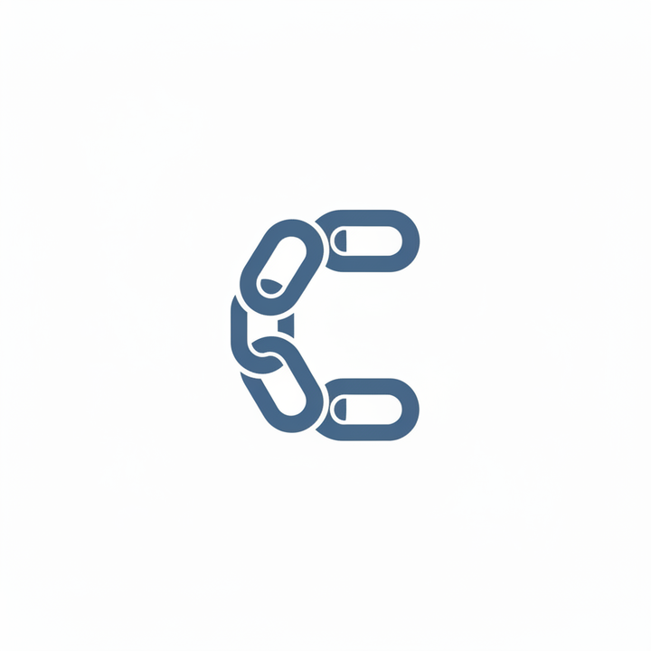
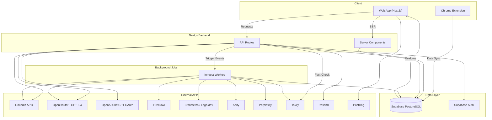
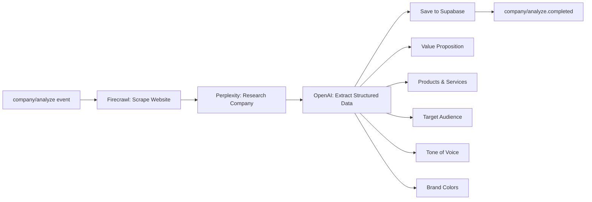
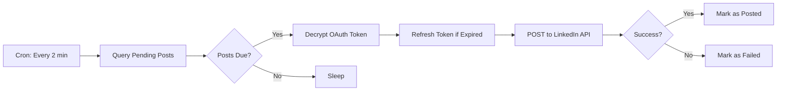
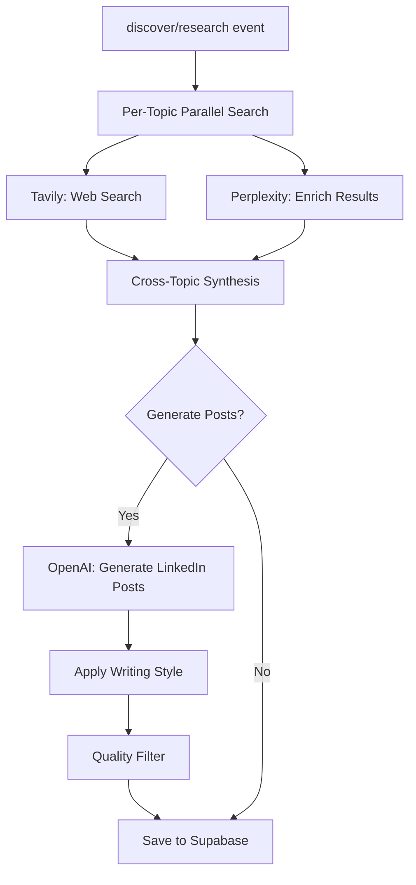
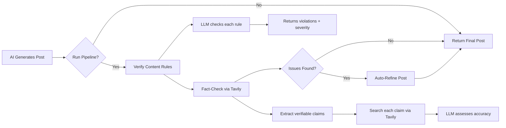
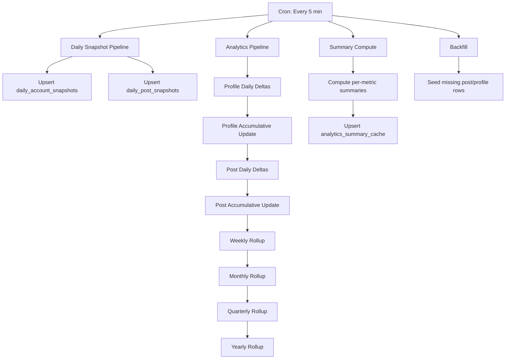

<p align="center">
  
</p>

<h1 align="center">ChainLinked</h1>

<p align="center">
  <strong>The LinkedIn content management platform built for teams.</strong>
</p>

<p align="center">
  
  
  
  
  
  
</p>

---

## Overview

ChainLinked is a full-stack SaaS platform that helps teams create, schedule, analyze, and optimize their LinkedIn content from a single workspace. It combines AI-powered writing assistance, deep research pipelines, a visual carousel creator, and real-time analytics into a unified dashboard designed for marketing teams, founders, and content creators.

The platform goes beyond simple scheduling. ChainLinked ingests trending content and news articles daily, lets users remix viral posts into their own voice, tracks influencer activity, and surfaces personalized post suggestions through a Tinder-style swipe interface. Every team member's performance is tracked with granular analytics that roll up from daily deltas into weekly, monthly, quarterly, and yearly aggregates.

ChainLinked also includes a companion Chrome extension that captures LinkedIn data directly from the browser -- profile analytics, post performance metrics, audience demographics, and connection data. The extension syncs this information to Supabase in real time, powering the analytics dashboards and feeding the AI generation pipeline with context about each user's audience.

---

## Key Features

### Post Composer
- Rich text editor powered by Lexical with live LinkedIn preview
- AI-powered content generation via OpenRouter (GPT-5.4)
- **Multi-step quality pipeline**: every generated post goes through LLM-based content rules verification, Tavily-powered fact-checking, and automatic refinement
- @mention support with LinkedIn member search and resolution
- Unicode font styling (bold, italic, serif, script, monospace, and more)
- Configurable default hashtags per user
- Post goal selector (engagement, thought leadership, traffic, etc.)
- Inline AI panel for rewriting, expanding, and tone adjustment
- Document/carousel post support via LinkedIn UGC API

### Post Scheduling
- Timezone-aware scheduling with calendar view
- Inngest cron pipeline that checks for pending posts every 2 minutes
- Automatic LinkedIn OAuth token refresh and encrypted storage
- Support for visibility controls (public, connections-only)
- Draft management with auto-save

### Analytics Dashboard
- Personal and team performance tracking
- **Real-time updates via Supabase Realtime** -- dashboard, analytics, drafts, team activity, invitations, join requests, and suggestions all refresh automatically via Supabase Realtime subscriptions (no page reload needed)
- Daily snapshot pipeline with absolute and delta modes
- Data table shows absolute daily values (impressions, reactions, comments, etc.)
- Trend charts show daily gains (deltas) for growth visualization
- Daily delta computation with weekly/monthly/quarterly/yearly rollups
- Interactive trend charts built with Recharts
- Filterable data tables powered by TanStack React Table
- Summary bar with key metrics at a glance
- CSV export for offline analysis
- Analytics backfill for historical data

### Brand Kit & AI Context
- Automatic brand extraction from any website URL via Firecrawl
- Logo and color palette retrieval via Brandfetch and Logo.dev
- Company context generation (value proposition, target audience, tone of voice)
- Perplexity-powered company research enrichment
- AI-extracted products/services, pain points, and competitive positioning
- **Full inline company context editor in Settings** -- same rich UI as onboarding step 4 (company info, brand identity, products & services, target audience/ICP, tone & voice) accessible from the settings page

### Team Management
- Email-based team invitations with Resend transactional emails
- Join request workflow with approval/rejection
- Role-based access control
- Team activity feed and leaderboard
- Pending invitation management

### Discover and Inspiration
- Daily automated news ingestion via Perplexity (sonar-pro)
- Trending topic tracking across 15+ categories
- Viral post curation with quality filtering
- Infinite scroll feed (IntersectionObserver-based auto-loading)
- Influencer tracking and post scraping via Apify
- News article detail view with source attribution
- Database-indexed queries for fast feed loading

### Swipe Interface
- Tinder-style card UI for accepting or dismissing post suggestions
- AI-generated suggestions based on company context and writing style
- Automatic refill when suggestion queue runs low
- Accepted posts flow directly into the compose editor

### Carousel Creator
- Visual canvas editor built with Konva and React-Konva
- Drag-and-drop slide management with DnD Kit
- Pre-built carousel templates with brand kit integration
- Background removal via Remove.bg API
- Unsplash image search integration
- PDF export via pdf-lib for LinkedIn document posts
- Font picker with custom typography options

### Template Library
- CRUD operations for reusable post templates
- Category-based organization with usage tracking
- Auto-generated templates based on company context and past performance
- Template analytics (usage count, performance correlation)

### Chrome Extension
- LinkedIn data capture (profile stats, post metrics, audience data)
- Automatic session sync for seamless login
- Background sync with Supabase
- Popup UI for quick access

### Onboarding
- Dual-path flow: company owner (creates team) vs. individual (joins team)
- **Duplicate company detection**: when creating a company that already exists, users are prompted to send a join request instead of creating a duplicate
- Four-step guided setup: profile, company context, brand kit, invite teammates
- Company analysis workflow triggered automatically on completion
- Join-by-invite and join-by-request team entry

### AI Research
- Multi-step deep research pipeline (Tavily search, Perplexity enrichment, OpenAI synthesis)
- Cross-topic synthesis with source attribution
- Writing style analysis and application ("My Style" mode)
- Configurable research depth (basic vs. deep)
- Content remix: transform any post or article into your voice and format

### Post Quality Pipeline
- **Content rules verification** -- a second LLM pass checks every generated post against user-configured and team-level content rules, reporting violations with severity and fix suggestions
- **Fact-checking** -- extracts verifiable claims from the post, searches each claim via Tavily, then assesses accuracy with source-backed verdicts (supported / refuted / unverifiable)
- **Auto-refinement** -- if the verification or fact-check steps find errors, the pipeline surgically fixes only the flagged issues while preserving the author's voice and style
- Pipeline runs automatically on every generation (opt-out via `runPipeline: false`) and is also available as a standalone `POST /api/ai/pipeline` endpoint
- Pipeline status UI component shows step-by-step progress, timing, and issue details

### ChatGPT OAuth Connection
- **Device-code OAuth flow** -- users connect their ChatGPT account (Plus/Pro) without entering an API key, using OpenAI's Codex device-code flow with PKCE
- Manual API key entry as a fallback
- Connection status, email, and plan type displayed in Settings
- Token refresh support and secure storage in Supabase with RLS
- One-click disconnect

### Prompt Management
- Version-controlled prompt system for AI generation
- Prompt playground for testing and iteration
- Diff viewer for comparing prompt versions
- Prompt analytics tracking generation quality

---

## Tech Stack

| Category | Technology |
|---|---|
| **Framework** | Next.js 16.1.1 (App Router) |
| **UI** | React 19.2.3, shadcn/ui (new-york style), Tailwind CSS v4 |
| **Database** | Supabase (PostgreSQL) with Row Level Security and Realtime subscriptions |
| **Auth** | Supabase Auth (email/password, Google OAuth) |
| **AI / LLM** | OpenRouter (GPT-5.4) via OpenAI SDK, Vercel AI SDK, ChatGPT OAuth (Codex device-code flow) |
| **Background Jobs** | Inngest (15 workflow functions, cron schedules) |
| **Web Scraping** | Firecrawl (website analysis), Apify (LinkedIn scraping) |
| **Research** | Perplexity API (sonar-pro), Tavily (web search + fact-checking) |
| **Brand Extraction** | Brandfetch, Logo.dev |
| **Email** | Resend + React Email (transactional emails) |
| **Charts** | Recharts 2.15.4 |
| **State** | React hooks, Context API, localStorage |
| **Rich Text Editor** | Lexical |
| **Canvas / Graphics** | Konva + React-Konva |
| **Drag and Drop** | DnD Kit |
| **PDF Export** | pdf-lib, JSZip |
| **Icons** | Tabler Icons + Lucide React |
| **Forms** | React Hook Form + Zod 4 validation |
| **Tables** | TanStack React Table |
| **Animation** | Framer Motion, Lottie |
| **Product Analytics** | PostHog |
| **Image Processing** | Remove.bg API, Unsplash API |
| **LinkedIn** | Official REST API (UGC/Posts) + Voyager (unofficial) |
| **Markdown** | react-markdown |
| **Testing** | Playwright (e2e) |

---

## Architecture Overview



---

## Project Structure

```
chainlinked/
├── app/                        # Next.js App Router
│   ├── api/                    # 30+ API route groups (ai, analytics, brand-kit,
│   │                           #   carousel-templates, company, discover, drafts,
│   │                           #   inngest, linkedin, posts, research, swipe,
│   │                           #   teams, templates, and more)
│   ├── dashboard/              # Main application pages
│   │   ├── analytics/          # Analytics dashboard
│   │   ├── carousels/          # Carousel creator
│   │   ├── compose/            # Post composer
│   │   ├── discover/           # Content discovery and news
│   │   ├── drafts/             # Draft management
│   │   ├── inspiration/        # Inspiration feed
│   │   ├── posts/              # Post history
│   │   ├── prompts/            # Prompt management and playground
│   │   ├── schedule/           # Post scheduling calendar
│   │   ├── settings/           # User and team settings
│   │   ├── swipe/              # Swipe suggestions interface
│   │   ├── team/               # Team dashboard and leaderboard
│   │   └── templates/          # Template library
│   ├── onboarding/             # Multi-step onboarding flow
│   ├── login/                  # Authentication pages
│   ├── signup/
│   └── privacy/                # Privacy policy
├── components/
│   ├── features/               # 80+ feature components
│   ├── shared/                 # Reusable components
│   ├── ui/                     # shadcn/ui component library
│   ├── emails/                 # React Email templates
│   ├── skeletons/              # Loading skeleton components
│   └── landing/                # Marketing page components
├── hooks/                      # 50+ custom React hooks
├── lib/
│   ├── ai/                     # AI client, prompts, quality filters, style analysis
│   │   └── pipeline/           # Post quality pipeline (verify, fact-check, refine)
│   ├── auth/                   # OpenAI OAuth (device-code flow, PKCE, token management)
│   ├── apify/                  # LinkedIn scraping integration
│   ├── brandfetch/             # Brand extraction
│   ├── canvas-templates/       # Carousel canvas templates
│   ├── email/                  # Email sending utilities
│   ├── firecrawl/              # Website scraping
│   ├── graphics-library/       # Graphics asset management
│   ├── image/                  # Image processing utilities
│   ├── inngest/                # Inngest client + 17+ workflow functions
│   ├── linkedin/               # LinkedIn API client (official + Voyager)
│   ├── perplexity/             # Perplexity API client
│   ├── prompts/                # Prompt management utilities
│   ├── research/               # Tavily search client
│   ├── store/                  # Client-side state stores
│   ├── supabase/               # Supabase client (server, browser, middleware, realtime utilities)
│   ├── team/                   # Team management utilities
│   └── unicode-fonts.ts        # Unicode font transformations
├── types/                      # TypeScript type definitions
├── services/                   # Service layer (onboarding)
├── scripts/                    # Data import and seed scripts
├── supabase/
│   └── migrations/             # 33 SQL migration files
├── extension/                  # Chrome extension (separate build)
│   ├── background/             # Service worker
│   ├── content/                # Content scripts
│   ├── popup/                  # Extension popup UI
│   └── manifest.json
├── e2e/                        # Playwright end-to-end tests
└── public/                     # Static assets (logos)
```

---

## Inngest Workflows

ChainLinked uses 17+ Inngest workflow functions for background processing:

| Function | Trigger | Description |
|---|---|---|
| `analyzeCompanyWorkflow` | `company/analyze` event | Scrapes website via Firecrawl, researches via Perplexity, extracts structured company context via OpenAI |
| `deepResearchWorkflow` | `discover/research` event | Multi-step research: Tavily search, Perplexity enrichment, cross-topic synthesis, post generation |
| `generateSuggestionsWorkflow` | `swipe/generate-suggestions` event | Generates personalized LinkedIn post suggestions from company context |
| `suggestionsReadyHandler` | `swipe/suggestions-ready` event | Handles post-generation cleanup and notification |
| `dailyContentIngest` | Cron (daily at 6 AM UTC) | Ingests fresh news articles via Perplexity for all users with selected topics |
| `onDemandContentIngest` | `discover/ingest` event | On-demand article ingestion for specific topics |
| `publishScheduledPosts` | Cron (every 2 minutes) | Queries pending scheduled posts, posts to LinkedIn, updates status |
| `swipeAutoRefill` | Cron | Checks suggestion queues and triggers refills for users running low |
| `analyticsPipeline` | Cron (every 5 min) | Computes daily deltas, rolls up into weekly/monthly/quarterly/yearly aggregates |
| `dailySnapshotPipeline` | Cron (every 5 min) | Upserts `daily_account_snapshots` and `daily_post_snapshots` with absolute values |
| `analyticsSummaryCompute` | Cron (every 5 min) | Pre-computes summary statistics for analytics dashboard |
| `analyticsBackfill` | Cron (every 5 min) | Backfills historical analytics data for new users |
| `firstSyncBackfill` | `sync/first-data` event | Single-user targeted backfill for immediate dashboard data after extension install |
| `templateAutoGenerate` | Cron | Auto-generates post templates based on company context |
| `influencerPostScrape` | `influencer/follow` event | Scrapes recent posts from followed influencers via Apify |
| `viralPostIngest` | Cron | Ingests viral posts from curated LinkedIn profiles with quality filtering |
| `ingestArticles` | Event-driven | Article ingestion with deduplication and freshness management |

### Company Analysis Pipeline



### Scheduled Post Publishing



### Deep Research Pipeline



### Post Quality Pipeline



### Analytics Pipeline



---

## Getting Started

### Prerequisites

- **Node.js** 20+
- **npm** 10+
- A **Supabase** project (PostgreSQL database and auth)
- A **LinkedIn** developer app with OAuth 2.0 configured
- An **OpenRouter** API key for AI features
- An **Inngest** account (or use the local dev server)

### Installation

```bash
# Clone the repository
git clone https://github.com/om13rajpal/chain-linked.git
cd chainlinked

# Install dependencies
npm install

# Copy environment variables
cp .env.example .env.local
# Edit .env.local and fill in all required values (see Environment Variables below)

# Run Supabase migrations
npx supabase db push

# Start the development server
npm run dev

# In a separate terminal, start the Inngest dev server
npm run dev:inngest
```

The app will be available at [http://localhost:3000](http://localhost:3000).
The Inngest dashboard will be at [http://127.0.0.1:8288](http://127.0.0.1:8288).

To run both concurrently:

```bash
npm run dev:all
```

### Build

```bash
npm run build
npm start
```

---

## Environment Variables

Copy `.env.example` to `.env.local` and configure the following groups:

### Supabase
| Variable | Description |
|---|---|
| `NEXT_PUBLIC_SUPABASE_URL` | Supabase project URL |
| `NEXT_PUBLIC_SUPABASE_ANON_KEY` | Supabase anonymous (public) key |
| `SUPABASE_SERVICE_ROLE_KEY` | Supabase service role key (server-side only) |

### Application
| Variable | Description |
|---|---|
| `NEXT_PUBLIC_APP_URL` | App URL for OAuth redirects, email links, extension detection |

### LinkedIn OAuth
| Variable | Description |
|---|---|
| `LINKEDIN_CLIENT_ID` | LinkedIn app client ID |
| `LINKEDIN_CLIENT_SECRET` | LinkedIn app client secret |
| `LINKEDIN_REDIRECT_URI` | OAuth callback URL |
| `LINKEDIN_POSTING_ENABLED` | Safety gate -- set to `true` to enable live posting |

### AI and LLM
| Variable | Description |
|---|---|
| `OPENROUTER_API_KEY` | OpenRouter API key (routes to GPT-5.4) |

### ChatGPT OAuth (Optional)
| Variable | Description |
|---|---|
| `OPENAI_CLIENT_ID` | OpenAI Codex OAuth client ID (defaults to public Codex CLI ID) |

### Research
| Variable | Description |
|---|---|
| `TAVILY_API_KEY` | Tavily API key for web search |
| `PERPLEXITY_API_KEY` | Perplexity API key for research enrichment |

### Scraping
| Variable | Description |
|---|---|
| `APIFY_API_TOKEN` | Apify token for LinkedIn profile and post scraping |

### Email
| Variable | Description |
|---|---|
| `RESEND_API_KEY` | Resend API key for transactional emails |
| `EMAIL_FROM_ADDRESS` | Sender email address |
| `EMAIL_FROM_NAME` | Sender display name |

### Security
| Variable | Description |
|---|---|
| `API_KEY_ENCRYPTION_SECRET` | Encryption key for OAuth tokens (minimum 32 characters) |
| `CRON_SECRET` | Secret for Vercel cron job authentication |

### Inngest
| Variable | Description |
|---|---|
| `INNGEST_EVENT_KEY` | Inngest event key (not required in development) |
| `INNGEST_SIGNING_KEY` | Inngest signing key for webhook verification |

### Product Analytics
| Variable | Description |
|---|---|
| `NEXT_PUBLIC_POSTHOG_KEY` | PostHog project key |
| `NEXT_PUBLIC_POSTHOG_HOST` | PostHog instance URL |

### Image and Brand
| Variable | Description |
|---|---|
| `NEXT_PUBLIC_LOGO_DEV_TOKEN` | Logo.dev token for company logo lookup |
| `UNSPLASH_ACCESS_KEY` | Unsplash API key for image search in carousel creator |
| `REMOVE_BG_API_KEY` | Remove.bg API key for background removal |

### Chrome Extension
| Variable | Description |
|---|---|
| `NEXT_PUBLIC_CHROME_STORE_URL` | Chrome Web Store listing URL |
| `NEXT_PUBLIC_EXTENSION_ID` | Extension ID for communication |

### Admin
| Variable | Description |
|---|---|
| `ADMIN_EMAILS` | Comma-separated list of admin email addresses |

---

## Database

ChainLinked uses **Supabase PostgreSQL** with **Row Level Security (RLS)** enabled on all tables. The schema is managed through SQL migration files in `supabase/migrations/`.

Key table groups:

- **Users and Auth** -- `users`, `linkedin_profiles`, `linkedin_tokens`, `user_api_keys`
- **Teams** -- team membership, invitations, join requests, role-based access
- **Content** -- `scheduled_posts`, `drafts`, `my_posts`, `post_analytics`
- **Analytics** -- `daily_account_snapshots`, `daily_post_snapshots`, `post_analytics_daily`, `post_analytics_accumulative`, `profile_analytics_daily`, `profile_analytics_accumulative`, `analytics_summary_cache`, `linkedin_analytics`, `analytics_history`
- **Discovery** -- `discover_posts`, `feed_posts`, `wishlist_collections`
- **AI and Research** -- `company_context`, `research_tables`, `swipe_suggestions`, `prompt_system`, `content_rules`
- **OAuth** -- `openai_connections` (ChatGPT OAuth tokens and manual API keys), `openai_device_sessions` (temporary device code sessions)
- **Templates** -- `carousel_templates`, post templates
- **Extension** -- `captured_apis`, `capture_stats`, `extension_settings`, `sync_metadata`, `connections`, `comments`, `followers`

All database access uses typed Supabase clients (server-side for Server Components, browser-side for client mutations) with generated TypeScript types in `types/database.ts`.

---

## Deployment

ChainLinked is designed for deployment on **Vercel**.

### Vercel Configuration

- **Framework Preset**: Next.js
- **Build Command**: `next build`
- **Install Command**: `npm install`
- **Node.js Version**: 20.x
- Set all environment variables from `.env.example` in the Vercel dashboard
- Configure the Inngest Vercel integration for automatic webhook registration
- Set up Vercel Cron for the `CRON_SECRET`-protected endpoints

### Inngest Production Setup

Register the Inngest serve endpoint at `/api/inngest` in your Inngest dashboard. All workflow functions will be automatically discovered and registered.

### Chrome Extension

The Chrome extension lives in the `extension/` directory with its own build tooling (Vite + esbuild). Build it separately:

```bash
cd extension
npm install
npm run build
```

The built extension can be loaded as an unpacked extension in Chrome or published to the Chrome Web Store.

---

## License

Proprietary. All rights reserved.

This software is the confidential property of ChainLinked. Unauthorized copying, distribution, or modification of this software is strictly prohibited.
